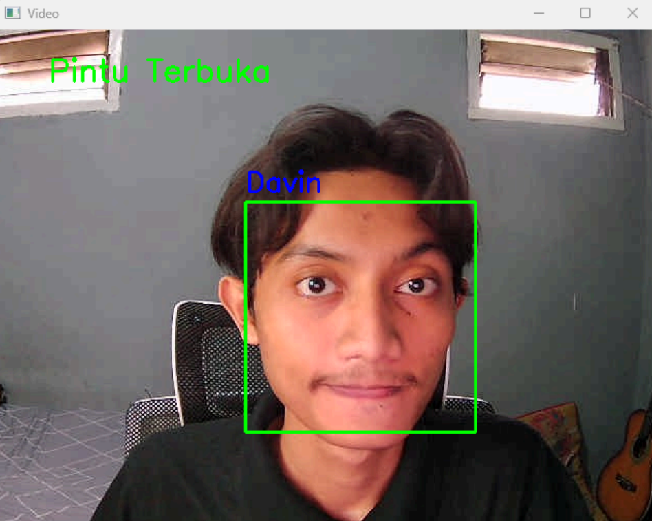

# OpenFace

OpenFace is a **face recognition powered smart lock system** that uses a webcam to authenticate users and control door access. The system captures multiple face poses for better accuracy, stores them in a dataset, and recognizes authorized individuals in real-time. If a registered face is detected, the system "unlocks" the door; otherwise, it remains locked.

---

## Features

- **Add New Faces**: Capture multiple face poses (front, left, right, and free poses) to improve recognition accuracy.
- **Real-time Recognition**: Detect faces live through the webcam and verify against the stored dataset.
- **Smart Lock Simulation**:
  - ✅ Display "Door Opened" for authorized users
  - ❌ Display "Door Closed" for unknown faces.
- **Delete Faces**: Remove unwanted faces from the dataset.
- **Persistent Storage**: All face encodings and names are stored in `face_dataset.pkl` for future sessions.

---

## Installation

1. **Clone the repository**

   ```bash
   git clone https://github.com/reyhanarief/openface.git
   cd openface
   ```

2. **Create a virtual environment (optional but recommended)**

   ```bash
   python -m venv venv
   source venv/bin/activate   # Mac/Linux
   venv\Scripts\activate      # Windows
   ```

3. **Install dependencies**

   Requires **Python 3.x**, **CMake**, and **C++ build tools** installed, then run:

   ```bash
   pip install -r requirements.txt
   ```

   If `requirements.txt` is missing, install manually:

   ```bash
   pip install opencv-python face_recognition numpy
   ```

4. **Run the program**
   ```bash
   python main.py
   ```

---

## Usage

When you start the program, you’ll see a menu:

1. **Add face to dataset** → Register a new face with multiple poses.
2. **Recognize face using camera** → Start live recognition mode.
3. **Delete face from dataset** → Remove a face from the dataset.
4. **Exit** → Quit the program.

ℹ️ Ensure your webcam is working before running the program.

---

## Project Structure

```
openface/
│── result/
│ └── demo.png             # Demo Screenshot
│── main.py                # Main program
│── face_dataset.pkl       # Saved dataset (auto-created)
│── requirements.txt       # Dependencies
│── LICENSE                # MIT License
└── README.md              # Documentation
```

---

## Demo Screenshot



---

## License

[](LICENSE)

---

## Future Improvements

- Connect to a **servo/relay** to physically lock/unlock a door.
- Replace `pickle` with a **database** for more scalable storage.
- Build a **GUI** for easier interaction.
- Enhanced security with **multi-factor authentication**.
